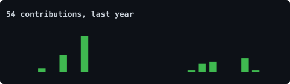
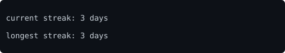
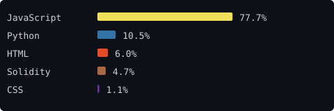

<!--
  Self-generating profile README.
  assets/portrait.svg is drawn once, locally, from your photo
  (scripts/generate_portrait.py).
  assets/stats.svg, streak.svg, languages.svg, year.svg are redrawn
  daily by .github/workflows/refresh-stats.yml straight from the GitHub
  API -- no third-party card services, nothing that can rate-limit or
  go dark.
-->

> Security-first builder. Shipping in Solidity + React, farming airdrops on the side.

<samp>react &nbsp;·&nbsp; solidity &nbsp;·&nbsp; vercel &nbsp;·&nbsp; python</samp>

**projects**

- [Arc Solidity Auditor](https://arc-solidity-auditor.vercel.app) — catches Arc-specific Solidity bugs (block.prevrandao, SELFDESTRUCT restrictions, USDC decimal mismatch) that standard tools miss
- [ChainCFO](https://chain-cfo-r9th.vercel.app) — autonomous on-chain financial OS dashboard
